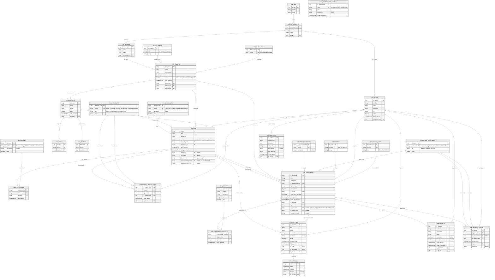

```mermaid
---
config:
  look: classic
  theme: neutral
---
erDiagram
    direction TB

    CRM_PAIS {
        Long id_pais PK ""
        String nombre ""
        String codigo ""
    }

    CRM_DEPARTAMENTO {
        Long id_departamento PK ""
        String nombre ""
        String codigo ""
        Long id_pais FK ""
    }

    CRM_MUNICIPIO {
        Long id_municipio PK ""
        String nombre ""
        String codigo ""
        Long id_departamento FK ""
    }

    CRM_DOCUMENTO {
        Long id_documento PK ""
        String tipo "nit, cedula, extranjeria, etc"
        String codigo ""
    }

    CRM_SECTOR {
        Long id_sector PK ""
        String nombre "agua, gas, agro, etc"
        String codigo ""
    }

    CRM_MODALIDAD {
        Long id_modalidad PK ""
        String nombre UK "exterior o interior del pais"
    }

    CRM_CONFIGURACION_SISTEMA {
        Long id_configuracion PK ""
        String clave UK "monto_minimo, dias_notificacion, etc"
        String valor ""
        String descripcion "nullable"
        LocalDateTime fecha_actualizacion ""
    }

    CRM_USUARIO {
        Long id_usuario PK ""
        String nombre ""
        String email ""
        String password ""
        String rol ""
        Boolean activo ""
        LocalDateTime fecha_creacion ""
        Long id_departamento FK ""
    }

    CRM_EMPRESA {
        Long id_empresa PK ""
        String nombre ""
        String no_documento ""
        Boolean activo ""
        Boolean nuevo "false al cerrar primera oportunidad ganada"
        LocalDateTime fecha_creacion ""
        Long id_municipio FK ""
        Long id_documento FK ""
        Long id_modalidad FK ""
    }

    CRM_CONTACTO {
        Long id_contacto PK ""
        String nombre ""
        String apellido ""
        Boolean activo ""
        LocalDateTime fecha_creacion ""
        Long id_empresa FK ""
    }

    CRM_EMAIL {
        Long id_email PK ""
        String email UK ""
        Long id_contacto FK ""
    }

    CRM_TELEFONO {
        Long id_telefono PK ""
        String numero ""
        Long id_contacto FK ""
    }

    CRM_ORIGEN_LEAD {
        Long id_origen_lead PK ""
        String nombre UK "Pagina Web, Facebook, Instagram, WhatsApp, etc"
        String descripcion "nullable"
        Boolean activo ""
    }

    CRM_ESTADO_LEAD {
        Long id_estado_lead PK ""
        String nombre UK "Nuevo, Contactado, Interesado, No Interesado, Traslado a Distribuidor"
        String tipo "ABIERTO, CALIFICADO, DESCALIFICADO"
        Integer orden ""
    }

    CRM_INTERES {
        Long id_interes PK ""
        String nombre UK "Sistemas de riego, Tuberia industrial, Asesoria tecnica, etc"
        String descripcion "nullable"
        Boolean activo ""
    }

    CRM_LEAD {
        Long id_lead PK ""
        String titulo ""
        String descripcion ""
        String motivo "detalle de calificacion o descalificacion"
        Long id_estado_lead FK ""
        Long id_origen_lead FK ""
        LocalDateTime fecha_creacion ""
        LocalDateTime fecha_actualizacion ""
        Long id_empresa FK "nullable"
        Long id_contacto FK "nullable"
        Long id_usuario FK "ejecutivo asignado"
        Long id_oportunidad_generada FK "nullable - se llena al convertir"
        String motivo_descalificacion "nullable"
    }

    CRM_LEAD_INTERES {
        Long id_lead_interes PK ""
        Long id_lead FK ""
        Long id_interes FK ""
        LocalDateTime fecha_registro ""
    }

    CRM_HISTORIAL_ESTADO_LEAD {
        Long id_historial_lead PK ""
        Long id_lead FK ""
        Long id_estado_anterior FK "nullable"
        Long id_estado_nuevo FK ""
        LocalDateTime fecha_cambio ""
        Long id_usuario FK ""
    }

    CRM_PRODUCTO {
        Long id_producto PK ""
        String nombre ""
        String descripcion ""
        String tipo ""
        Boolean activo ""
    }

    CRM_TIPO_OPORTUNIDAD {
        Long id_tipo_oportunidad PK ""
        String nombre UK ""
        String descripcion "nullable"
    }

    CRM_ESTADO_OPORTUNIDAD {
        Long id_estado PK ""
        String nombre UK "Prospeccion, Negociacion, Cerrada Ganada, Cerrada Perdida"
        String tipo "ABIERTO, GANADO, PERDIDO"
        Integer orden ""
    }

    CRM_MOTIVO_CIERRE {
        Long id_motivo_cierre PK ""
        String nombre UK ""
        String tipo "GANADO, PERDIDO"
    }

    CRM_OPORTUNIDAD {
        Long id_oportunidad PK ""
        String titulo ""
        String descripcion ""
        Long id_tipo_oportunidad FK ""
        Long id_estado_oportunidad FK ""
        BigDecimal valor_estimado ""
        Long id_sector FK ""
        LocalDate fecha_cierre_estimada ""
        LocalDateTime fecha_creacion ""
        LocalDateTime fecha_actualizacion ""
        Long id_empresa FK ""
        Long id_usuario FK ""
        Long id_lead_origen FK "nullable - cruzar con empresa.nuevo para medir clientes nuevos"
        Long id_motivo_cierre FK "nullable"
        String descripcion_cierre "nullable"
    }

    CRM_OPORTUNIDAD_PRODUCTO {
        Long id_oportunidad_producto PK ""
        Long id_oportunidad FK ""
        Long id_producto FK ""
        LocalDateTime fecha_agregado ""
    }

    CRM_ACTIVIDAD {
        Long id_actividad PK ""
        String tipo ""
        String asunto ""
        String descripcion ""
        String resultado "nullable"
        Boolean virtual ""
        LocalDateTime fecha_actividad ""
        LocalDateTime fecha_creacion ""
        Long id_lead FK "nullable"
        Long id_oportunidad FK "nullable"
        Long id_usuario FK ""
    }

    CRM_UBICACION {
        Long id_ubicacion PK ""
        BigDecimal latitud ""
        BigDecimal longitud ""
        String direccion "nullable"
        Long id_actividad FK ""
    }

    CRM_PROYECTO {
        Long id_proyecto PK ""
        String nombre ""
        String descripcion ""
        String estado ""
        LocalDate fecha_inicio "nullable"
        LocalDate fecha_fin "nullable"
        LocalDateTime fecha_creacion ""
        LocalDateTime fecha_actualizacion ""
        Long id_oportunidad FK ""
        Long id_usuario FK ""
    }

    CRM_HISTORIAL_ESTADO {
        Long id_historial PK ""
        Long id_oportunidad FK ""
        Long id_estado_anterior FK "nullable"
        Long id_estado_nuevo FK ""
        LocalDateTime fecha_cambio ""
        Long id_usuario FK ""
        String comentario "nullable"
    }

    CRM_AUDITORIA {
        Long id_auditoria PK ""
        String nombre_tabla ""
        Long id_registro ""
        String valor_antiguo "nullable"
        String valor_nuevo "nullable"
        String tipo_operacion ""
        LocalDateTime fecha_registro ""
        Long id_usuario FK ""
    }

    CRM_PAIS ||--o{ CRM_DEPARTAMENTO : "contiene"
    CRM_DEPARTAMENTO ||--o{ CRM_MUNICIPIO : "contiene"
    CRM_DEPARTAMENTO ||--o{ CRM_USUARIO : "area asignada"
    CRM_MUNICIPIO ||--o{ CRM_EMPRESA : "ubicada en"
    CRM_DOCUMENTO ||--o{ CRM_EMPRESA : "tipo documento"
    CRM_MODALIDAD ||--o{ CRM_EMPRESA : "modalidad"
    CRM_EMPRESA ||--o{ CRM_CONTACTO : "tiene contactos"
    CRM_CONTACTO ||--o{ CRM_EMAIL : "tiene emails"
    CRM_CONTACTO ||--o{ CRM_TELEFONO : "tiene telefonos"

    CRM_ORIGEN_LEAD ||--o{ CRM_LEAD : "origen"
    CRM_ESTADO_LEAD ||--o{ CRM_LEAD : "estado actual"
    CRM_EMPRESA ||--o{ CRM_LEAD : "relacionado"
    CRM_CONTACTO ||--o{ CRM_LEAD : "contacto asociado"
    CRM_USUARIO ||--o{ CRM_LEAD : "asignado a"
    CRM_LEAD ||--o{ CRM_LEAD_INTERES : "tiene intereses"
    CRM_INTERES ||--o{ CRM_LEAD_INTERES : "aplica a lead"
    CRM_LEAD ||--o{ CRM_HISTORIAL_ESTADO_LEAD : "cambia estado"
    CRM_ESTADO_LEAD ||--o{ CRM_HISTORIAL_ESTADO_LEAD : "estado anterior"
    CRM_ESTADO_LEAD ||--o{ CRM_HISTORIAL_ESTADO_LEAD : "estado nuevo"
    CRM_USUARIO ||--o{ CRM_HISTORIAL_ESTADO_LEAD : "ejecuta cambio"

    CRM_LEAD ||--o| CRM_OPORTUNIDAD : "se convierte en"
    CRM_LEAD ||--o{ CRM_OPORTUNIDAD : "lead origen"
    CRM_EMPRESA ||--o{ CRM_OPORTUNIDAD : "genera"
    CRM_TIPO_OPORTUNIDAD ||--o{ CRM_OPORTUNIDAD : "clasifica"
    CRM_ESTADO_OPORTUNIDAD ||--o{ CRM_OPORTUNIDAD : "estado actual"
    CRM_SECTOR ||--o{ CRM_OPORTUNIDAD : "sector"
    CRM_USUARIO ||--o{ CRM_OPORTUNIDAD : "asignada a"
    CRM_MOTIVO_CIERRE |o--o{ CRM_OPORTUNIDAD : "motivo cierre"
    CRM_OPORTUNIDAD ||--o{ CRM_OPORTUNIDAD_PRODUCTO : "incluye productos"
    CRM_PRODUCTO ||--o{ CRM_OPORTUNIDAD_PRODUCTO : "asociado a"

    CRM_LEAD ||--o{ CRM_ACTIVIDAD : "actividades lead"
    CRM_OPORTUNIDAD ||--o{ CRM_ACTIVIDAD : "actividades oportunidad"
    CRM_USUARIO ||--o{ CRM_ACTIVIDAD : "realiza"
    CRM_ACTIVIDAD ||--o| CRM_UBICACION : "ubicada en"

    CRM_OPORTUNIDAD ||--o| CRM_PROYECTO : "puede generar"
    CRM_USUARIO ||--o{ CRM_PROYECTO : "asignado a"

    CRM_OPORTUNIDAD ||--o{ CRM_HISTORIAL_ESTADO : "cambia estado"
    CRM_ESTADO_OPORTUNIDAD ||--o{ CRM_HISTORIAL_ESTADO : "estado anterior"
    CRM_ESTADO_OPORTUNIDAD ||--o{ CRM_HISTORIAL_ESTADO : "estado nuevo"
    CRM_USUARIO ||--o{ CRM_HISTORIAL_ESTADO : "ejecuta cambio"

    CRM_USUARIO ||--o{ CRM_AUDITORIA : "registra cambios"
```